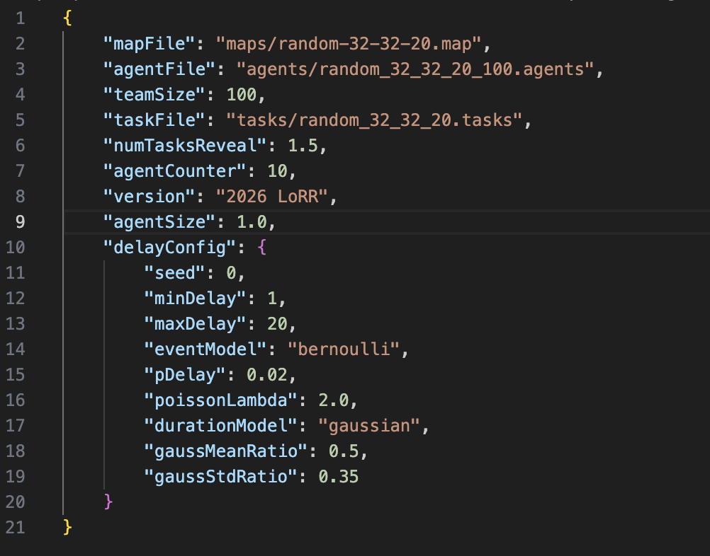
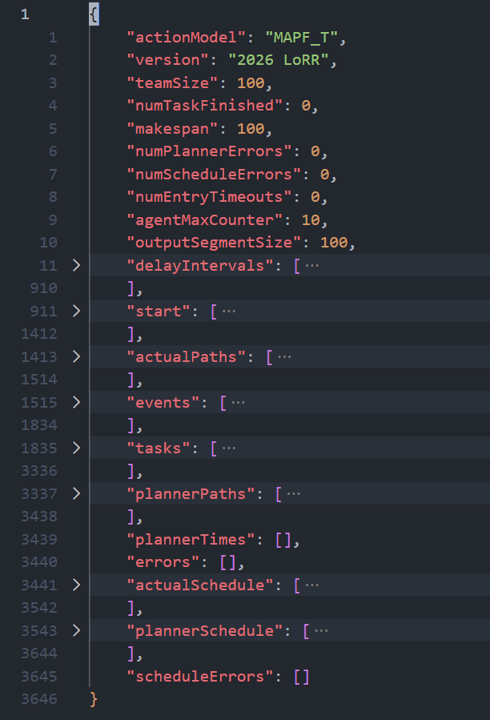

## 输入参数

| Option | Type | Description |
|---|---:|---|
| `--help` |  | 显示帮助信息。 |
| `--inputFile` / `-i` | String | 输入问题 JSON 文件路径（**必填**）。 |
| `--output` / `-o` | String | 输出 JSON 路径（默认：`./output.json`）。 |
| `--prettyPrintJson` | Bool | 将输出 JSON 美化换行，而非单行写入（默认：`false`）。 |
| `--outputScreen` / `-c` | Int | 输出 JSON 详细程度：`1` = 完整输出；`2` = 仅摘要统计、实际路径与任务完成事件；`3` = 仅摘要统计（省略 events/tasks/errors/plannerTimes/starts/paths）。 |
| `--logFile` / `-l` | String | 将日志重定向到此文件（可选）。 |
| `--logDetailLevel` / `-d` | Int | 日志文件级别：`1` = 全部，`2` = 警告+致命，`3` = 仅致命。 |
| `--fileStoragePath` / `-f` | String | 大文件存储路径。若为空，读取 `$LORR_LARGE_FILE_STORAGE_PATH`。 |
| `--simulationTime` / `-s` | Int | 仿真的最大 **执行 tick** 数（规划视野）。 |
| `--preprocessTimeLimit` / `-p` | Int (ms) | 预处理时间限制（仿真开始前的加载/预计算）。 |
| `--actionMoveTimeLimit` / `-a` | Int (ms) | **执行 tick** 时长 / 每 tick 时间预算。执行器在每个 tick 下受此预算约束。 |
| `--initialPlanTimeLimit` / `-n` | Int (ms) | **首次**规划调用的时间预算。 |
| `--planCommTimeLimit` / `-t` | Int (ms) | 规划更新之间的最小通信间隔（规划器周期性调用，非每 tick）。 |
| `--executorProcessPlanTimeLimit` / `-x` | Int (ms) | 处理/暂存返回规划的时间预算（规划采纳步骤）。 |
| `--outputActionWindow` / `-w` | Int | 路径输出压缩窗口大小（默认 100）。输出路径按该 tick 数分块。*（本分支中，驱动程序当前使用 100 作为分块大小。）* |
| `--evaluationMode` / `-m` | Bool | 评测已有输出文件（供工具/评测脚本使用）。 |

## 输入问题文件（JSON 格式）

此处所有路径均为相对于输入 JSON 文件所在位置的相对路径

| Property | Type | Description |
|---|---:|---|
| `mapFile` | String | 描述栅格环境输入的文件的相对路径。我们使用下一节描述的栅格地图格式（含指向相关小节的链接） |
| `agentFile` | String | 描述机器人起点位置的文件相对路径。第一行为机器人数量 n。接下来 n 行对应 n 个机器人的起点位置。* |
| `taskFile` | String | 描述任务位置的文件相对路径。第一行为任务数量 m。接下来 m 行每行包含多个整数，每个整数对应任务在栅格上的一个位置，\* 同一行中位置的顺序表示该任务应完成的顺序 |
| `delayConfig` | Object | 运行时延迟生成的内联配置。见下文 `delayConfig` 字段。 |
| `teamSize` | Int | 仿真中的机器人数量  |
| `numTasksReveal` | Float | 任务池中发布任务的倍数。我们始终在任务池中保持 numTasksReveal 倍 teamSize 个已发布任务。若某时间步有 k 个任务完成，系统会向任务池加入 k 个任务 |
| `agentSize` | Float | 基于重叠碰撞检测的机器人安全正方形边长（默认 `1.0`）。必须 > 0。 |
| `maxCounter` | Int | 完成一次 **前进/旋转** 动作所需的执行 tick 数（默认 `10`）。 |                                                                                                                                                                                   |

示例如下：

### 时间行为说明（双速率循环）

- 仿真器每个 **执行 tick** 推进（快循环）。
- 规划器 **周期性**调用（慢循环），规划更新之间至少间隔 `planCommTimeLimit` ms。
- 若某次规划调用迟到，仿真会使用最近已接受的暂存动作继续（若无可用暂存动作，机器人可能有效等待）。

### `delayConfig` 字段

| Field | Type | Description |
|---|---:|---|
| `seed` | Int | 运行时延迟生成器使用的确定性种子。 |
| `minDelay` | Int | 采样延迟时长的最小值。 |
| `maxDelay` | Int | 采样延迟时长的最大值。 |
| `eventModel` | String | 延迟事件模型：`bernoulli` 或 `poisson`。 |
| `pDelay` | Float | 使用 `bernoulli` 模型时每智能体的延迟概率。 |
| `poissonLambda` | Float | 使用 `poisson` 模型时的泊松率。 |
| `durationModel` | String | 延迟时长模型：`uniform` 或 `gaussian`。 |
| `gaussMeanRatio` | Float | 使用 `gaussian` 时长模型时，在 `[minDelay, maxDelay]` 内的相对均值位置。 |
| `gaussStdRatio` | Float | 使用 `gaussian` 时长模型时，在 `[minDelay, maxDelay]` 内的相对标准差。 |

## 地图文件格式

\* 我们将二维坐标线性化并用单个整数表示一个位置。给定位置 (row,column) 及地图高度（总行数）与宽度（总列数），线性化位置 = row*width+column。

所有地图均以以下行开头：

> type octile  
> height y  
> width x  
> map  

地图符号：
| symbols                |                                                                                                                                                                                                                                                |
|------------------------|------------------------------------------------------------------------------------------------------------------------------------------------------------------------------------------------------------------------------------------------|
| @                      | 硬障碍。                                                                                                                                                                  |
| T                      | 硬障碍（游戏环境中的「树木」）。                                                                                                                                                                  |
| .                      | 自由空间 |
| E                      | 发射点（用于「配送」目标）- 可通行              |
| S                      | 服务点（用于「取货」目标）- 可通行                                                                                                                                                                                                        |

## 输出文件（JSON 格式）

`./lifelong` 的输出文件为 JSON 格式，包含规划器输出、机器人实际路径及统计信息。

下表定义输出文件中出现的属性。

| properties      |                                                                                                                                                                                                                                                                                                                                                                                 |
|-----------------|---------------------------------------------------------------------------------------------------------------------------------------------------------------------------------------------------------------------------------------------------------------------------------------------------------------------------------------------------------------------------------|
| actionModel     | String   仿真器中机器人使用的动作模型名称，该值始终为 "MAPF_T"，表示带转向的 MAPF（即机器人可朝向四个主方向之一，可用动作为前进、顺时针旋转、逆时针旋转与等待）                                                                                                                                                                                                                                                                                                  |
| teamSize        | Int   仿真中的机器人数量                                                                                                                                                                                                                                                                                                                                                     |
| agentMaxCounter | Int | 本次运行使用的 `maxCounter`（每次前进/旋转动作的 tick 数） |
| outputSegmentSize | Int | 压缩路径输出使用的段/窗口长度 |
| delayIntervals | List | `n` 个智能体各自的延迟区间列表，其中 `n` 为机器人数量。每个区间为 `[start_timestep, end_timestep]`。仅当 `outputScreen <= 2` 时包含。 |
| start           | List   起点位置列表。列表长度为机器人数量。                                                                                                                                                                                                                                                                                           |
| numTaskFinished | Int   已完成任务数。                                                                                                                                                                                                                                                                                                                                             |
| sumOfCost       | Int                                                                                                                                                                                                                                                                                                                                                                        |
| makespan        | Int   仿真视野（Simulation Horizon）                                                                                                                                                                                                                                                                                                                                                    |
| actualPaths | List | `n` 个压缩路径字符串的列表（已执行行为），其中 `n` 为机器人数量。（仅当 `outputScreen <= 2`） |
| plannerPaths | List | `n` 个压缩路径字符串的列表（规划/暂存行为）。（仅当 `outputScreen <= 1`） 
| plannerTimes    | List   entry 每次规划回合的计算时间（秒）列表。                                                                                                                                                                                                                                                                          |
| errors          | List   动作错误列表。每个错误由列表 [task_id, robot1, robot2, timestep, description] 表示，其中 robot1、robot2、timestep 为整数，description 为字符串。robot1 与 robot2 对应涉错机器人的 id（仅涉及一个机器人时 robot2=-1）。description 为错误消息。  |
| actualSchedule | List   n 个字符串的列表，n 为机器人数量。每个字符串表示新的/更新的（有效）首个任务调度及其变更时间，以 "," 分隔。每个任务调度中，时间与任务调度以 ":" 分隔，任务调度包含该智能体的首个任务，例如 "0:0,5:3," 表示某智能体在时间步 0 将任务 0 调度为首个任务，在时间步 5 将任务 3 调度为首个任务。|
| plannerSchedule | List   n 个字符串的列表，n 为机器人数量。每个字符串表示 taskScheduler 提议的新的/更新的（有效或无效）任务调度及其变更时间，以 "," 分隔。 |
| events          | List   （任务）事件列表。每个事件由列表 [timestep, agent_id, task_id, sequence_id] 表示，均为整数。sequence_id 表示任务进度及智能体正在前往的任务中的哪个差事，也表示该任务中已完成多少个差事。                                                                                                                  |
| scheduleErrors          | List   调度错误列表。每个错误由列表 [task_id, robot1, robot2, timestep, description] 表示，其中 task_id、robot1、robot2、timestep 为整数，description 为字符串。robot1 与 robot2 对应涉错机器人的 id（仅涉及一个机器人时 robot2=-1）。description 为错误消息。  |
| tasks           | List   任务列表。每个任务由表示任务各位置的多个整数列表 [id, release_time, errand_sequence] 表示，errand_sequence 为差事位置列表：[x1,y1,x2,y2, ... ... ]|
| numPlannerErrors | Int   规划器错误（无效动作）数量。 |
| numScheduleErrors | Int   调度错误（无效调度）数量。 |
| numEntryTimeouts | Int   entry 超时次数。 |

示例如下：

### 路径字符串格式（`actualPaths` 与 `plannerPaths`）

每个机器人路径编码为一系列 **段**（窗口）。每段包含：

- 段起始时刻的快照状态，以及
- 若干 `(action, duration)` 对，用于压缩重复动作（例如 FW10 表示连续 10 次 FW）。

段格式：

`[(t,row,col,ori,counter):(A d, A d, ...)]`

其中：
- `t` 为段起始时间步（执行 tick）
- `(row, col, ori, counter)` 为段起始快照
- 每个 `(A d)` 表示动作 `A` 连续应用 `d` 个 tick

多个段在字符串中拼接以表示完整运行。

### 延迟区间格式（`delayIntervals`）

`delayIntervals` 为每个机器人一条记录的列表。每个机器人条目为延迟区间列表：

`[[start_timestep, end_timestep], ...]`

其中：
- `start_timestep` 为延迟开始的执行 tick
- `end_timestep` 为延迟结束的执行 tick

示例：

`[[], [[12, 15], [40, 42]], [[7, 9]]]`

含义：
- 机器人 0 无延迟
- 机器人 1 在区间 `[12, 15]` 与 `[40, 42]` 延迟
- 机器人 2 在区间 `[7, 9]` 延迟
