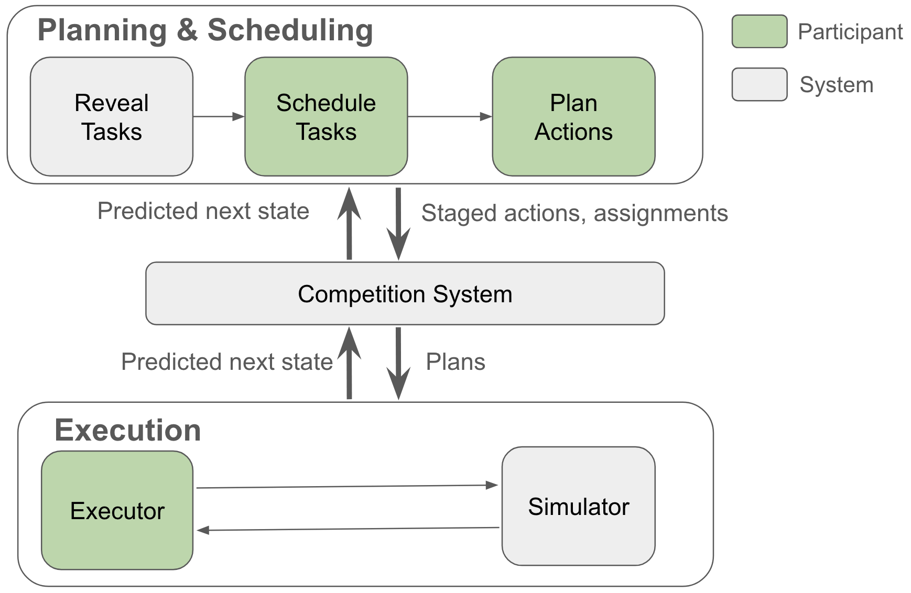

# 准备您的参赛作品

要运行程序，请参阅 [README.md](./README.md) 下载 start-kit 并完成编译。

本文档说明：
- 竞赛系统如何调用 `Entry`、`Planner`、`Scheduler` 与 **Executor（执行器）**，
- 您在 `SharedEnvironment` 中可获得哪些数据，
- 您需要返回什么（调度 + **多步规划**），
- **双速率**（规划器 vs 执行器）循环中的时间/超时如何工作，
- 如何在本地构建与测试。

---

## 系统概览

下图展示 start-kit 的主要组件：



start-kit 为规划/调度 entry 与执行运行 **双速率控制循环**（关于中央控制器的更多说明，请参阅我们的[竞赛网页](https://www.leagueofrobotrunners.org/)）：

### A) 规划更新（慢循环）
每隔若干执行 tick，竞赛系统会：
1. 将最新环境信息同步到 `SharedEnvironment`（`env`），
2. 调用 `Entry::compute(time_limit, proposed_plan, proposed_schedule)`。

在 `Entry::compute()` 内部（默认实现在 `src/Entry.cpp`）：
- `TaskScheduler::plan()` 产生 `proposed_schedule`，
- `Entry::update_goal_locations()` 更新 `env->goal_locations`，
- `MAPFPlanner::plan()` 产生 `proposed_plan`（**多步规划**，见下文）。

`Entry::compute()` 返回后，系统会：
3. 调用 **Executor** 处理新规划并更新每个智能体的 `staged_actions`（在下次规划更新前将执行的动作队列），
4. 继续使用这些已暂存的动作执行。

### B) 执行 tick（快循环）
每个执行 tick（即使在规划运行时），系统会：
1. 调用 Executor 决定每个智能体的执行命令（GO/STOP），
2. 将 GO/STOP 与已暂存动作转换为本 tick 的 **请求动作**，
3. 应用延迟（可能迫使部分智能体 STOP/等待），
4. 用动作模型仿真一个 tick 的运动（基于连续重叠的碰撞处理），
5. 更新机器人状态与任务进度。


上图展示 start-kit 中的交互循环。系统周期性调用 `Entry::compute(...)`，让规划器/调度器返回 **多步、栅格级** 的规划与任务调度。随后系统调用 `Executor::process_new_plan(...)` 以 **暂存** 新规划，将其与任何未完成动作合并（遵守多 tick **承诺**），并产生更新后的 `staged_actions`（以及可选的预测状态）。同时，每个 tick 系统调用 `Executor::next_command(...)` 输出每个智能体的 **GO/STOP**，应用延迟/安全检查，并推进仿真器。

---

## 重要概念（代码层面）

开始前请熟悉代码库中的以下概念：

### 坐标系
机器人在地图上的位置为 (row, col)。
- row 向下递增，顶部从 0 开始
- col 向右递增，左侧从 0 开始

参见 [coordination_system.pdf](./image/coordination_system.pdf)。

### 地图表示
地图为行主序的 `vector<int>`。
(row, col) 的索引为 `row * cols + col`。
单元格取值：
- `1` = 障碍（不可通行）
- `0` = 空闲（可通行）

### `State`（机器人状态）
定义于 `inc/States.h`。

除 `(location, timestep, orientation)` 外，状态还包括：
- `counter`：当前动作内的进度（`inc/Counter.h`）
- `delay`：智能体当前是否处于延迟（`inc/Delay.h`）
- `moveType`：智能体是否处于过渡或旋转中（`Transition / Rotation / None`）

这很重要，因为动作可能需要 **多个 tick** 才能完成。

### `Task`
定义于 `inc/Tasks.h`。

任务为必须按顺序访问的一系列差事（`locations`）。
字段包括：
- `task_id`
- `agent_assigned`
- `idx_next_loc`（下一个未完成差事的索引）

仅当第一个差事未完成（`idx_next_loc == 0`）时可重新分配任务。
一旦机器人开启任务（完成第一个差事），则不可再重新分配。

### 规划器层 `Action`
定义于 `inc/ActionModel.h`：
- `FW`（前进）
- `CR`（顺时针旋转）
- `CCR`（逆时针旋转）
- `W`（等待）
- `NA`（不适用/保留；请勿在规划中输出）

**规划器动作为栅格级意图**（例如 `FW` 表示「朝下一格移动」）。

### 执行层 `ExecutionCommand`
同样定义于 `inc/ActionModel.h`：
- `GO`（本 tick 允许推进）
- `STOP`（本 tick 暂停）

执行器每个 tick 输出 `GO/STOP`；仿真器再应用动作模型与安全规则。

### `Plan` 与 `staged_actions`
- `Plan` 定义于 `inc/Plan.h`。
- 规划存储 `plan.actions`，类型为 `vector<vector<int>>`。

含义：
- `plan.actions[i]` 为智能体 `i` 的规划器级动作序列，
  编码为整数，对应 `Action` 枚举（`FW=0, CR=1, CCR=2, W=3, ...`）。

执行器将返回的 `Plan` 转为 `staged_actions`：
- `staged_actions[i]` 为智能体 `i` 已准备好执行的动作队列。
- 这些暂存动作逐 tick 执行，直到采用新规划。

可在 `env->staged_actions` 读取当前暂存动作。

**重要说明**：在综合赛道中，您可以自定义 `Plan`，但您的执行器也需要负责理解 `Plan` 并将其转换为要暂存并交给系统的 `Action` 序列。换言之，系统只接受 `inc/ActionModel.h` 中定义的 `Action` 序列作为暂存动作。

## 执行模型（计数器、延迟与基于重叠的安全）

### 多 tick 动作（counter）
`FW`、`CR`、`CCR` 需要多个执行 tick。
进度由 `State.counter` 跟踪。
计数器完成后，离散位置/朝向更新。

### 延迟
在延迟 tick 中，智能体被强制等待/STOP。
这会暂停计数器进度并可能造成拥堵。

### 碰撞与安全（无顶点/边规则）
本分支不使用「顶点」或「边」冲突。
安全由几何重叠保证：
- 智能体建模为轴对齐正方形（「安全气泡」）
- 障碍为实心正方形
- 在一个 tick 上连续检查重叠（扫掠碰撞）

若某智能体的请求运动不安全，动作模型可能在本 tick 将其覆盖为 `W`。
该覆盖可按智能体发生（不一定「全员等待」）。

实际含义：
- 您的规划器可在栅格级输出无碰撞规划，但执行器/动作模型
  仍是最终权威，仍可能因连续重叠约束、延迟与依赖解析而 STOP/等待智能体。


## SharedEnvironment（`SharedEnv`）

`SharedEnvironment` 定义于 `inc/SharedEnv.h`，以 `env` 形式提供。

包含：

### 静态环境信息
- `num_of_agents`、`rows`、`cols`
- `map_name`
- `map`（vector<int>）
- `file_storage_path`（用于存储/加载辅助数据）

### 时间 / 执行参数
- `plan_start_time`：系统调用 `Entry::compute()` 的时刻
- `min_planner_communication_time`：规划更新之间的最短时间间隔（ms）
- `action_time`：每个执行 tick 的时间预算（ms）
- `max_counter`：完成一个动作（FW/CR/CCR）所需的 tick 数

### 机器人状态视图
系统提供两种有用的状态「视图」：

- `system_states`：执行器循环中的 **当前物理状态**（逐 tick）。
- `curr_states`：用于规划更新的 **规划快照状态**。
  这些可能是预测/处理后的状态（例如在暂存规划窗口之后），
  可能与 `system_states` 不同。

另有：
- `system_timestep`：当前执行 tick。
- `curr_timestep`：预测状态的起始时间步，设为 0。
- `staged_actions`：当前为执行暂存的每智能体动作队列。

### 任务信息
- `curr_task_schedule`：当前调度（智能体 -> task_id，或 -1）
- `task_pool`：已发布但未完成的任务（task_id -> Task）
- `new_tasks`：本次更新新发布的任务
- `new_freeagents`：本次更新刚完成任务的智能体
- `goal_locations`：每智能体下一目标（由调度推导；由 Entry 更新）

> 注意：`system_timestep` 可能在 `Entry::compute()` 期间推进，因为规划运行时执行器仍在 tick。**不要假设规划期间时间冻结。**

---

## 时间与超时（实际行为）

系统中有若干时间预算：

### 预处理（硬限制）
评测开始前会调用 `Entry::initialize(preprocess_time_limit)` 与 `Executor::initialize(int preprocess_time_limit)`。
若任一预处理超过该限制，运行终止（退出码 124）。

### 规划更新时间限制（软限制）
`Entry::compute(time_limit, ...)` 有时间上限。
若超时：
- 执行器继续使用上次已接受的暂存动作进行 tick，
- 下一次规划更新会延迟到当前规划调用结束。

换言之：规划迟到会减少规划更新频率；**仿真不会冻结**。

### 执行器每 tick 时间限制（软限制）
每个执行 tick 会调用 `Executor::next_command(exec_time_limit)`。
若过慢，您会有效损失执行时间（仿真可能通过所有智能体安全等待等行为补偿）。
请保持 `next_command` 轻量。

### 规划处理时间限制（软限制）
`Executor::process_new_plan(sync_time_limit, ...)` 也应高效。
若过慢，处理方式类似规划迟到，即系统会继续 tick 并调用 `next_command`，而尚无新规划。

---

## Entry 集成

## 规划器 / 调度器 / 执行器 API（固定）

以下函数签名不得更改：

### 调度器
文件：`inc/TaskScheduler.h`、`src/TaskScheduler.cpp`
- `TaskScheduler::initialize(int preprocess_time_limit)`
- `TaskScheduler::plan(int time_limit, vector<int>& proposed_schedule)`

返回：
- `proposed_schedule[i] = task_id` 或 `-1`（无任务）

无效调度示例：
- 同一任务分配给多个智能体
- 分配已完成/未发布/不存在的任务
- 将已开启的任务重新分配给另一智能体
- 对已开启任务的智能体赋 `-1`（无效）

若调度无效或超时，系统保留上一份有效调度。

### 规划器
文件：`inc/MAPFPlanner.h`、`src/MAPFPlanner.cpp`
- `MAPFPlanner::initialize(int preprocess_time_limit)`
- `MAPFPlanner::plan(int time_limit, Plan& plan)`

返回：
- `plan.actions[i]` = 智能体 `i` 的动作序列（多步规划）

**支持多步规划，且推荐使用。**
若智能体用尽暂存动作，将被 STOP，直到有新动作暂存。

### 执行器
文件：`inc/Executor.h`、`src/Executor.cpp`
- `Executor::initialize(int preprocess_time_limit)`
- `Executor::process_new_plan(int sync_time_limit, Plan& plan, vector<vector<Action>>& staged_actions)`
- `Executor::next_command(int exec_time_limit, vector<ExecutionCommand>& agent_command)`

返回：
- `process_new_plan(...)` 更新 `staged_actions` 并返回预测状态。
- `next_command(...)` 为下一 tick 输出每智能体的 `GO/STOP`。

## 理解默认组件

### 默认 entry
在 `src/Entry.cpp` 中可找到默认 entry 实现。在 `Entry::compute()` 中，默认 entry 先调用默认调度器。调度器完成后，机器人可能被分配新任务，其目标位置（每个机器人已调度任务的下一个差事）会写入 `env->goal_locations` 供规划器使用。
随后 entry 调用默认规划器计算机器人动作。
时间限制会同时提供给默认调度器与规划器。在默认调度器与规划器内部，可见它们各自使用时间限制的一半。

### 默认调度器
在 `src/TaskScheduler.cpp` 中可找到默认任务调度器，其调用的函数在 `default_planner/scheduler.cpp` 中进一步定义。
- 默认调度器的预处理函数（见 `scheduler.cpp` 中的 `schedule_initialize()`）调用 `DefaultPlanner::init_heuristics()`（见 `default_planner/heuristics.cpp`）初始化全局启发式表，用于存储不同位置间的距离。这些距离在仿真过程中按需计算。调度器用这些距离估计给定机器人在给定任务上的完成时间。
- 默认调度器的调度函数（见 `scheduler.cpp` 中的 `schedule_plan()`）实现贪心调度：每次调用 `schedule_plan()` 时，遍历每个尚未分配任务的机器人；对每个被遍历的机器人，遍历尚未分配给任何机器人的任务，将 makespan（从机器人当前位置依次经过任务所有差事的行程距离）最小的任务分配给该机器人。

### 默认规划器
在 `src/MAPFPlanner.cpp` 中可找到默认规划器实现，其调用的函数在 `default_planner/planner.cpp` 中进一步定义。默认规划器与默认调度器共享同一启发式距离表。其 `initialize()` 准备必要的数据结构和全局启发式表（若调度器未初始化）。其 `plan()` 为当前时间步计算无碰撞动作。

默认规划器实现的 MAPF 规划器是 Traffic Flow Optimised Guided PIBT 的变体，参见 [Chen, Z., Harabor, D., Li, J., & Stuckey, P. J. (2024, March). Traffic flow optimisation for lifelong multi-agent path finding. In Proceedings of the AAAI Conference on Artificial Intelligence (Vol. 38, No. 18, pp. 20674-20682)](https://ojs.aaai.org/index.php/AAAI/article/view/30054/31856)。规划器先为每个机器人优化交通流分配，再按优化后的交通流使用 [Priority Inheritance with Backtracking](https://www.sciencedirect.com/science/article/pii/S0004370222000923) (PIBT) 为多步计算无碰撞动作。

> ⚠️ **注意** ⚠️，默认规划器是 anytime 算法，即用于计算解的时间会直接影响解的质量。 
> 当分配时间较少时，默认规划器行为类似 vanilla PIBT。当分配时间较多时，默认规划器会更新交通成本并增量重算引导路径以改善到达时间。
> 若您参加的是 Scheduling Track，请记住 `schedule_plan()` 越早返回，留给默认规划器的时间就越多。
> 更好的规划与更好的调度都会显著影响您在排行榜上的表现。 
> 如何在这两个组件之间分配时间是成功策略的重要一环。

### 默认规划器与调度器的时间参数

每个时间步，我们会要求您的规划器在给定的 `time_limit`（毫秒）内为每个机器人计算下一个有效动作。`time_limit` 作为 `Entry.cpp` 中 `compute()` 的输入参数传入，再传给 `TaskScheduler::plan()` 和 `MAPFPlanner::plan()`。注意，对 `TaskScheduler::plan()` 和 `MAPFPlanner::plan()` 而言，当前时间步的起始时间为 `env->plan_start_time`，即调度器与规划器应在 `env->plan_start_time` 加上 `time_limit` 毫秒之前返回动作。这是软限制：若在 `time_limit` 届满前未返回动作，仿真会继续，所有机器人将原地等待到下一规划回合。

默认调度器与默认规划器按顺序运行。默认调度器使用 `time_limit/2` 作为计算调度的时限。
默认规划器在调度器返回后使用剩余时间计算无碰撞动作。

您仍可部分控制默认调度器与默认规划器的时间行为。
文件 `default_planner/const.h` 中定义了若干控制调度器与规划器时间的参数：
- `PIBT_RUNTIME_PER_100_AGENTS` 指定 PIBT 每 100 个机器人计算无碰撞动作所需的毫秒数。默认规划器用时间限制减去 PIBT 动作时间得到交通流分配的结束时间，将剩余时间留给 PIBT 返回动作。
- `TRAFFIC_FLOW_ASSIGNMENT_END_TIME_TOLERANCE` 指定交通流分配过程结束时间的容差（毫秒）。默认规划器会在交通流分配结束时间前这么多毫秒结束交通流分配阶段。
- `PLANNER_TIMELIMIT_TOLERANCE` MAPFPlanner 会从默认规划器的时间限制中减去该值。
- `SCHEDULER_TIMELIMIT_TOLERANCE` TaskScheduler 会从默认调度器的时间限制中减去该值。

允许修改这些参数的值以增减相关组件的用时。

### 默认 Executor

在 `src/Executor.cpp`（API 在 `inc/Executor.h`）中，默认执行器为快 tick 循环提供基线 **执行策略**。

它有两项职责：

1）**规划采纳与暂存**（`process_new_plan`）
- 规划器可能返回较长的多步规划。执行器将所有新规划动作暂存到每智能体的 `staged_actions`，使系统能平滑持续执行。
- 新规划到达时，执行器将其与已在进行中的已暂存动作合并。
- 执行器还会生成**预测状态**快照，作为下一次规划调用的输入。这是通过仿真执行所有暂存动作后的结果状态完成的。

2）**逐 tick 执行决策**（`next_command`）
每个执行 tick，执行器为每个智能体输出一个 GO/STOP 执行命令：

默认执行器基于当前局部情况构建 [**时间依赖图（Temporal Dependency Graph, TPG）**](Ma, H., Kumar, T. S., & Koenig, S. (2017, February). Multi-agent path finding with delay probabilities. In Proceedings of the AAAI Conference on Artificial Intelligence (Vol. 31, No. 1))。TPG 捕捉每个位置上智能体访问顺序的时间依赖。例如，若路径中某位置先由智能体 1 访问，再由智能体 2 访问，则执行也应遵循该顺序。当智能体 1 延迟时，智能体 2 也需等待，直到智能体 1 进入并离开该位置。换言之，执行器据此依赖结构推导 GO/STOP 决策，优先推进不违反隐含顺序的进度。

## 各赛道的实现内容

（若竞赛年份使用不同赛道命名，请以网站说明为准；上述 API 保持不变。）

- **调度赛道（Scheduling Track）**：实现您的调度器；默认规划器 + 默认执行器与之配合运行。
- **执行赛道（Execution Track）**：实现您的执行器；默认规划器/调度器提供意图。
- **综合赛道（Combined Track）**：实现规划器、调度器与执行器。

综合设置下也可修改 `Entry`，但不得更改 API 签名。

### 不可修改的文件

除各赛道相关的实现文件及下文提到的可修改文件外，start-kit 中大部分文件不可修改，且必须确保不干扰其功能。 
更多细节请参阅 [Evaluation_Environment.md](./Evaluation_Environment.md)。

---

## 构建

实现规划器后，需要编译您的提交以进行本地测试与评测。
本节说明编译系统的工作方式及如何指定依赖。

### Compile.sh

- 评测系统会在竞赛服务器上执行 `compile.sh` 来构建您的程序。
- 评测系统会查找并执行 `./build/lifelong` 进行评测。
- 请确保 `compile.sh` 生成的可执行文件名为 `lifelong`，且位于 `build` 目录下。
- 默认情况下 `compile.sh` 会构建 C++ 接口实现。要构建 Python 实现（见下文），请删除 `# build exec for cpp` 之后的命令，并取消注释 `# build exec for python` 之后的命令。
- 您可根据实现需要调整 `compile.sh`。
- 允许根据需求自定义 `compile.sh` 和 `CMakeLists.txt`，但必须确保不干扰 start-kit 功能，且所有相关功能（尤其不可修改文件中的实现）均被编译。

### 依赖

实现中可自由使用第三方库或其他依赖。可通过以下方式指定：
- 将依赖包含在提交仓库中，
- 在 apt.txt 中列出依赖包。这些包须能在 Ubuntu 22 上通过 apt-get 安装。

## Python 接口
本竞赛阶段 Python 接口尚未就绪，**目前不支持用于提交**。

我们计划在正赛阶段提供完整支持的 Python 接口。

## 评测

规划器实现并编译完成后，即可进行本地测试与评测。
评测系统使用官方 PyTorch 镜像 [pytorch/pytorch:2.4.1-cuda11.8-cudnn9-devel](https://hub.docker.com/layers/pytorch/pytorch/2.4.1-cuda11.8-cudnn9-devel/images/sha256-ebefd256e8247f1cea8f8cadd77f1944f6c3e65585c4e39a8d4135d29de4a0cb?context=explore) 作为 Docker 基础镜像构建评测环境，其中已包含 GPU 驱动、CUDA、cuDNN 等必要 GPU 软件。我们在此环境中官方支持并测试了 `Pytorch`，其他框架在评测环境中可能可用也可能不可用。

更多细节请参阅 [Evaluation_Environment.md](./Evaluation_Environment.md)。

### 本地测试
`example_problems` 目录下提供了多种测试问题。可使用其中任意 JSON 输入文件进行测试。
评测结果会写入您通过命令行参数 `--output_file_location` 指定的输出文件。
输入问题与输出结果的格式详见 [Input_Output_Format.md](./Input_Output_Format.md)。

### 在 Docker 中测试
评测系统在作为沙箱的 Docker 容器中构建并执行您的实现。
为确保实现能按预期构建与运行，可在本地构建 Docker 容器。

首先，在您的机器上安装最新版 Docker：[https://docs.docker.com/engine/install/](https://docs.docker.com/engine/install/)。
然后，使用我们提供的 `RunInDocker.sh` 脚本构建容器。 
本节剩余部分说明脚本用法及如何使用 Docker 容器。

#### 使用 `RunInDocker.sh`

* 在代码库根目录执行 `./RunInDocker.sh`。该脚本会根据 `pytorch/pytorch:2.4.1-cuda11.8-cudnn9-devel` 自动生成 Dockerfile 并构建镜像。
* 但镜像 `pytorch/pytorch:2.4.1-cuda11.8-cudnn9-devel` 仅支持 linux/amd64 系统/架构。若您使用其他系统/架构（例如 Arm CPU 的 MacOS）且不使用 GPU，可使用 [ubuntu:jammy](https://hub.docker.com/layers/library/ubuntu/jammy/images/sha256-58148fb210e3d70c972b5e72bdfcd68be667dec91e8a2ed6376b9e9c980cd573?context=explore) 作为替代，通过指定基础镜像运行脚本：`./RunInDocker.sh ubuntu:jammy`。
* 脚本会将您的代码复制到 Docker 环境，使用 apt-get 安装 `apt.txt` 中的依赖、使用 pip 安装 `pip.txt` 中的 Python 包，并用 `compile.sh` 编译代码。
* 脚本结束后您即处于容器内。
* 此时可在容器内运行已编译的程序。
* 镜像名 `<image name>` 为 `mapf_image`，容器名 `<container name>` 为 `mapf_test`。
* 默认工作目录为 `/MAPF/codes/`。
* 您可以在容器内测试与评测您的实现。
* 使用命令 `exit` 退出容器。

#### 启动已有容器：
  * 后台运行：`docker container start <container name>`
  * 交互式：`docker container start -i <container name>`

#### 在容器外执行命令
若 Docker 容器在后台启动，可从容器外执行命令（将容器视为可执行对象）。
 
  * 使用前缀：`docker container exec <container name> `加上要执行的命令，例如：
  ```shell
  docker container exec mapf_test ./build/lifelong --inputFile ./example_problems/random.domain/random_20.json -o test.json
  ``` 
 
  * 所有输出保存在容器内。可从容器复制文件。例如：`docker cp mapf_test:/MAPF/codes/test.json ./test.json`，将 `test.json` 复制到当前工作目录。

## 预处理与大文件存储

每次评测开始前，我们允许您的 entry 对每张地图有 30 分钟的预处理时间，用于加载支持文件并初始化支持数据结构。 
`preprocess_time_limit` 作为参数传入您 entry 的 `initialize()` 函数；默认会调用 MAPFPlanner 和 TaskScheduler 的 `intialize()`。若 entry 的预处理超过 `preprocess_time_limit`，规划器将失败，仿真会以 **退出码 124** 终止。 

更多细节请参阅 [Working_with_Preprocessed_Data.md](./Working_with_Preprocessed_Data.md) 中的文档。
